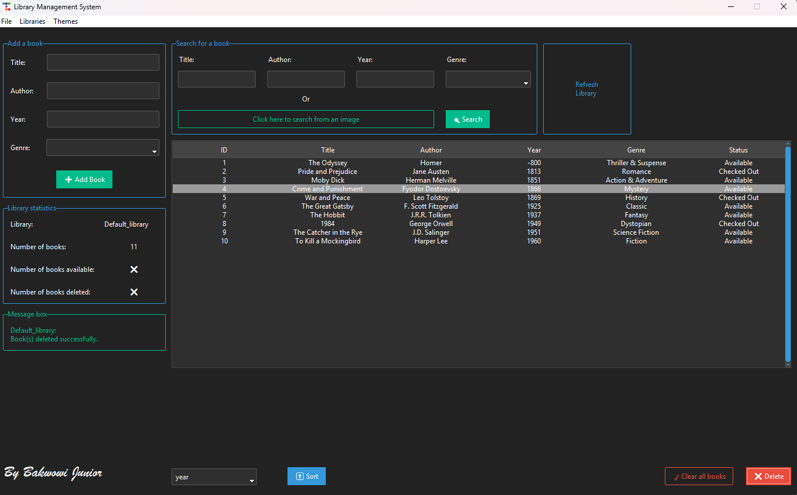
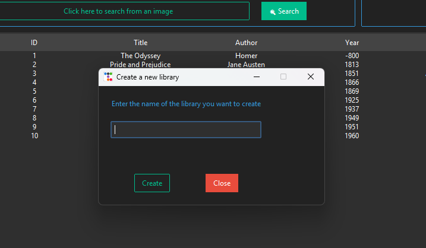
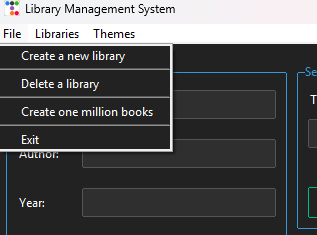
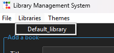
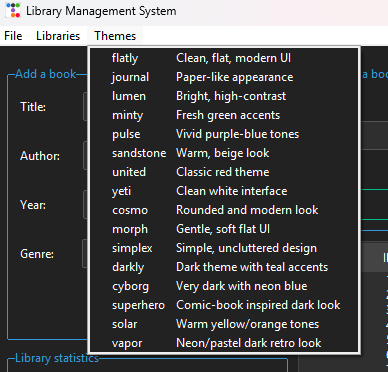
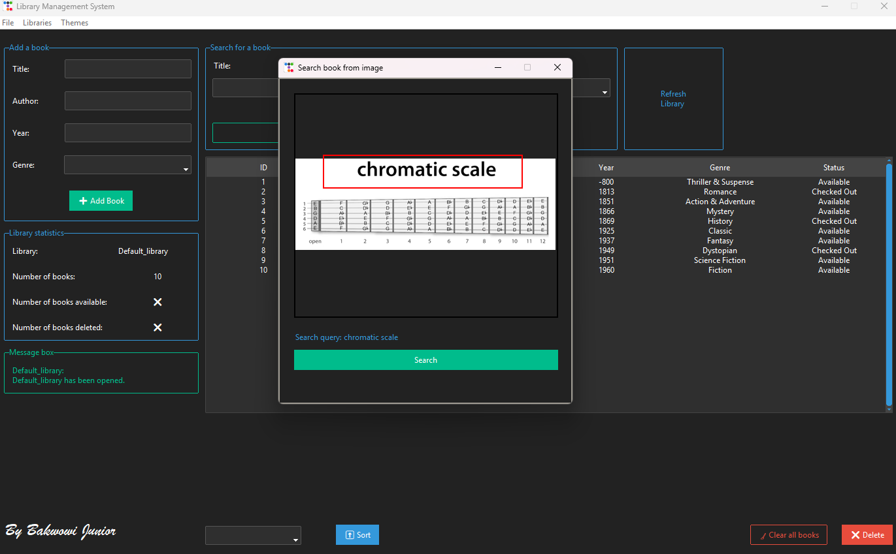

# Tkinter Library Manager

A desktop library management application built with Python and Tkinter. It uses `ttkbootstrap` for themed widgets, JSON files for local storage, and Tesseract OCR for searching from text inside an image.

## Screenshots


<!-- Replace these paths with screenshots committed to the repository. -->













## Features

- Add books with a title, author, publication year, genre, and availability status.
- Search books by title, author, year, or genre.
- Search for a book by selecting text in an image with OCR.
- Delete selected books or clear an entire library.
- Sort books by title, author, year, or genre.
- Create and delete additional JSON-backed libraries.
- Switch between multiple `ttkbootstrap` themes.
- Generate a large batch of sample book records with progress feedback.
- Run model, controller, and system tests.

## Requirements

- Python 3.7 or newer
- Tkinter, usually included with standard Python installations
- Tesseract OCR for image search

## Installation

1. Clone the repository and open its directory:

	```bash
	git clone https://github.com/<your-username>/tkinter-library.git
	cd tkinter-library
	```

2. Install the Python dependencies:

	```bash
	python -m pip install ttkbootstrap pillow pyocr
	```

3. Install Tesseract OCR by following the [official installation guide](https://tesseract-ocr.github.io/tessdoc/Installation.html).

	On Windows, the application also checks `C:\\Program Files\\Tesseract-OCR`. If Tesseract is installed elsewhere, add its installation directory to your system `PATH` or update the path in `view.py`.

## Usage

Start the application from the project directory:

```bash
python main.py
```

Library data is stored as JSON files in the `libraries/` directory. The application creates the default library file automatically when it is missing.

To search from an image:

1. Select **Search from image** in the application.
2. Choose an image file.
3. Drag over the text you want to recognize.
4. Run the search using the extracted text.

## Running Tests

Run the test suite with:

```bash
python -m unittest discover -s tests -p "*_test.py"
```

## Project Structure

```text
tkinter-library/
├── assets/
├── libraries/
│   └── Default_library.json       # Default local library data
├── profiling/                     # Profiling scripts
├── tests/
│   ├── model_unit_test.py         # Model unit tests
│   ├── controller_integration_test.py
│   └── system_test.py             # System-level tests
├── controller.py                  # UI event handling and coordination
├── main.py                        # Application entry point
├── model.py                       # Library data and business logic
├── view.py                        # Tkinter user interface
└── README.md
```

## Data Storage

Each library is saved as a separate JSON file under `libraries/`. This keeps the project simple and portable, but it is intended for local use rather than concurrent or production-scale access.

## Author

Bakwowi Junior

## Acknowledgments

- [Python](https://www.python.org/)
- [Tkinter](https://docs.python.org/3/library/tkinter.html)
- [ttkbootstrap](https://ttkbootstrap.readthedocs.io/)
- [Pillow](https://python-pillow.org/)
- [pyocr](https://github.com/jflesch/pyocr)
- [Tesseract OCR](https://github.com/tesseract-ocr/tesseract)